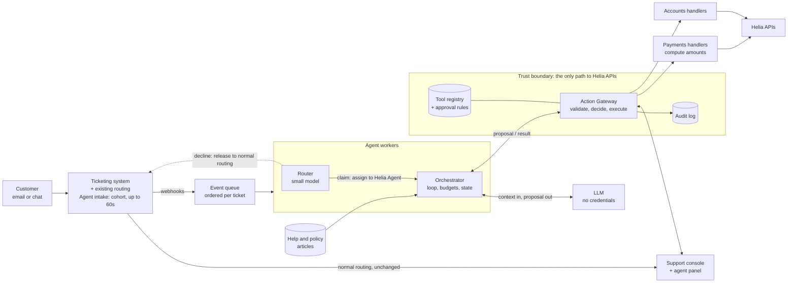

# 2. Design: Helia AI support agent

**The principle: the model proposes; the gateway decides and executes.** The model never holds credentials. Every call to a Helia API goes through one Action Gateway, ordinary code that applies the rules. A wrong or manipulated model can suggest a bad action but can't carry it out.

**Assumptions** (all numbers are starting values for Finance and leadership to confirm)
- **Systems:** about 5,000 cases a day by email and chat, in the existing ticketing system, which has an API, webhooks and room for a console panel. Helia's write APIs accept idempotency keys.
- **Speed and cost:** replies in about 4 seconds typically and 10 at p95, for cases the agent finishes alone. Up to $0.10 of model calls per case, router and grader included: a mid-sized hosted model at about 6k input tokens (half cached) and 300 output tokens per call.
- **Identity:** chat customers are signed in. Email senders confirm through a sign-in link before any write, or any reply showing account details. Billing and plan changes need the owner or billing-admin role.
- **Refund policy:** a 14-day money-back guarantee, so a charge's age is the whole check for that reason.
- **Ownership:** a small platform team owns the gateway, the agent, and the reply, lookup and escalate tools. Payments and Accounts own their tools, including the code that computes amounts and eligibility.

## 2.1 Architecture

**How a request becomes an action**
1. **Intake.** New tickets from customers in the **agent cohort** wait in "Agent intake" for up to 60 seconds; everyone else goes to humans as today. The cohort size is the rollout dial.
2. **Routing.** The **router** classifies the request type with a small model. It claims the ticket by assigning it to "Helia Agent" (the case lock), or releases it.
3. **Context.** The **orchestrator** runs the loop from an event queue ordered per ticket, saving state between events. It reads the thread, a masked account summary and help articles.
4. **Proposal.** The **model** proposes one step, seeing only that request type's tools.
5. **Decision.** The **gateway** checks the proposal and the ticket owner, gets amounts from the owning team's handler, applies the **registry** rule (execute, hold for approval, or reject), and logs everything.
6. **Approval.** People approve in an **agent panel in the existing console**, and reassigning a ticket takes it back at any time.

## 2.2 The agent loop

**Each turn**, the orchestrator re-reads the thread and the case state. One model call returns a short plan, **one** next step, and its evidence. The gateway runs, holds or rejects the step, and the result (the actual amount, the error, or the rejection reason) comes back as data; success is never assumed. The agent then continues, replies, asks the customer, or escalates. One action per turn means nothing is built on a wrong first step.

*Example, "charged twice":* the gateway confirms the duplicate and refunds $49, and the next turn replies. That's two model calls, about 4 seconds.

**When it stops.** The case is done when the reply is sent, and waits (state saved) for an approval or the customer. It stops if a person takes over or a kill switch is on. It hands over if the model escalates, the customer asks for a person (honoured at once), two proposals are rejected or one repeats, a tool keeps failing, or a budget runs out: 4 agent model calls, 3 writes, $0.10, or 15 seconds of active time. The handover note says what the customer wants, what was done, what's pending, and why.

**If the model is confidently wrong.** Assume it will be, so safety never depends on it. Amounts come from Helia's data, and references must belong to this customer. Eligibility is checked in code. Replies can't commit to anything unconfirmed (see 2.3). An hourly auto-refund cap and monitors limit the damage at scale, and QA and reopened tickets catch the rest. **The risk we accept:** an action that passes every check but is still wrong for this customer, which is why only low-value or reversible actions run alone.

## 2.3 The human-in-the-loop line

The line follows **how much harm a wrong action does and whether it can be undone**, not the model's confidence. This table is the target state; in the assisted stage, a person approves everything. The full "never" list is in standard §3.3.

| Action | The agent may do it alone when… | A person approves first when… |
|---|---|---|
| **Read account** | Always: masked, this customer only, logged. | — |
| **Reply** | Commitments come from templates and the reply checks pass. | — Sensitive topics (legal, privacy, security, disputes) go to a person. |
| **Refund** | ≤ $100, a reason billing data confirms (e.g. a real duplicate), within the policy window, no refund in 90 days, and under the hourly cap. | $100–$1,000: a support lead. Over $1,000: a lead and Finance. |
| **Plan change** | A downgrade with no refund owed, or an upgrade once the customer confirms the price. | A custom or enterprise contract: a support agent. |
| **Account change** | Display name, timezone, notifications. | Billing details: a support agent. Identity fields: never. |
| **Escalate** | Always. It's never blocked. | — |

**Where it's enforced, not just written down**
1. **The rules live in the tool registry, and the gateway applies them** to values the owning team's code computed. Only the gateway reaches the handlers, and only the handlers hold API credentials.
2. **Approvals happen in the console under the approver's own login,** and the gateway checks their role. The agent's identity can propose but never approve. Approvals stay meaningful by staying rare (under 10% of agent cases), and near-100% approval in a category triggers a QA re-check.
3. **An approval is bound to a fingerprint of the exact action.** If the amount, the account, the ticket owner or the rules change, or a kill switch is on, it's void. Undecided approvals expire after 24 hours.
4. **Two kinds of rule, two owners.** Support Ops owns the auto-approve conditions, with Finance signing off those that move money. Finance and Legal own the hard ceilings, which override everything. Changes need a reviewed merge request and a test: "refunds over $500 always pause" is one ceiling line and one test, with no prompt change.

**Replies.** Code can't check that free text is *correct*, so the gateway controls what a reply *commits to*. Amounts, dates, refunds and plan changes come only from tool-owned templates, which Legal reviews and the gateway fills from confirmed results. Code blocks free text that contains commitment words ("refund", "credit", "guarantee"), amounts, dates, other customers' data, unapproved links or unknown citations. Policy wording that needs those words, such as how refunds work, is quoted from the cited help article, never written by the model. A grader model flags any other promises and unsupported policy claims, but it can only send a reply to a person, never approve one. Every reply says it's from Helia's AI assistant and offers a person.

**Escalation** (its risks: safety and credibility). Sensitive topics are kept from the agent at routing and re-checked on every new message. The handover rate is tracked per request type, and the handover note means customers never repeat themselves.

## 2.4 Failure and rollback

Two rules: **a timeout means "unknown", not "failed"**, and **nothing that moves money is undone automatically.**

| Failure | What happens |
|---|---|
| **Timeout or temporary error** | Ask the API whether it already happened, then retry up to twice with the same idempotency key. If it's still unknown, a person checks billing, and the customer is told only that a person has their case. |
| **Fails partway through** | Completed steps stay done, and the rest is retried, then handed over. Steps are ordered so a half-finished case leaves the customer no worse off. |
| **Worker crashes** | Keys come from the case and the business object (`case_4512:ch_881`), so a replay can't pay twice. |
| **Agent systems down** | Intake times out to humans, a ticketing rule returns idle agent tickets after 10 minutes, and the platform team is paged. |

**Catching and undoing.** Wrong actions surface through reopened tickets and complaints (sent to a person, never back to the agent), a "flag error" button, QA sampling, and monitors that trip the kill switch. Finance's daily reconciliation against the audit log also checks the gateway itself. Each tool declares its undo, which a person triggers through the gateway: switch the plan back, restore the saved value, or send a correction. Refunds can't be undone, which is why their rules are the tightest.

**What people see.** The customer hears only confirmed outcomes. While an approval waits, they get a holding message saying a person is reviewing it; if it expires, a person takes over; on a failure, they get an honest "a member of our team has your case". The support agent gets the ticket flagged with the reason, the handover note, and a step-by-step timeline with Undo.

## 2.5 Guardrails for the team

The rules are in the [team standard](03-team-standard.md), and the platform enforces them:
- **Tools:** the gateway won't load an incomplete tool definition, and there are no generic `call_api` or SQL tools.
- **Releases:** definitions, approval rules, prompts, the pinned model version and policy articles ship as one versioned bundle. Each release must pass policy edge tests, attack tests, and offline evaluation on about 1,000 labelled past tickets.
- **Audit:** the gateway writes an append-only, hash-chained log, with its latest hash published daily and personal data by reference. The orchestrator adds a pointer to each step's model input and output. For automatic actions, the approver of record is the rule version and whoever approved it, so Finance's "who approved what" is one query.

## 2.6 Rollout

The agent earns autonomy **one request type at a time**, moving one dial at a time: request types, autonomy level, or cohort size. The weeks are planning assumptions and include building the platform.

| Stage | Gate to move on |
|---|---|
| **0. Offline** (weeks 1–4): evaluation and attack tests. | Tests pass; a kill-switch drill works in under a minute. |
| **1. Shadow** (weeks 5–6, 10%): drafts on copies; nothing executes. | Same action and amount as humans in ≥ 90% of cases; every "never" proposal reviewed by a person, and none caused by an ordinary request. |
| **2. Assisted** (weeks 7–9, 5%): a person approves everything. | ≥ 95% approved unedited, a QA re-check finds no wrong approvals, and CSAT and reopens within 2 points of control. |
| **3. Autonomous** (week 10 onwards, 5 → 100%): the 2.3 rules for questions, duplicate-charge refunds and downgrades; then more types, one at a time. | Metrics green at each step. |

**Metrics** are measured against customers outside the cohort. For safety: zero executed "never" actions (any one trips the kill switch), and wrong actions under 1%; blocked "never" proposals are alerted on as attack signals but don't trip it. For customers: reopen rate and CSAT within 2 points of control. For operations: automation and handover rates, p95 reply time, cost per case, and the share of cases stopped by a budget.

**Kill switches** work per tool, per request type, globally, or by setting the cohort to 0%. A switched-off tool also stops actions already waiting, and hands their cases to a person. Support Ops, the on-call engineer or Finance can switch off instantly; switching back on needs the cause understood.

**Getting both teams building the same way**
1. **Write the tool contract together** in week one, from what both teams have built.
2. **Freeze the old helpers in week one.** Revoke their direct credentials once their tools are in the registry, before any customer sees an agent action.
3. **Migrate, don't rewrite.** Existing logic becomes the handlers, and a platform engineer pairs on each team's first tool.
4. **Make the standard path the fast path:** the scaffold, tests, evaluation, console panel and audit come free. When the standard slows a team down, fix that step in the platform, never with an exception to the gateway or the audit log.

## Key trade-offs

| Choice | What we give up | Why |
|---|---|---|
| **A gateway in front of every API call** | A central team in every new tool's path, and one component whose outage stops agent actions. | One place for rules and records; outages fall back to humans. |
| **One agent, many tools** | Teams can't tune their own prompt or loop. | One audit trail; cross-team cases in one place. |
| **Existing routing stays in charge** | Cohort tickets wait up to 60 seconds if the agent is down; approvals sit in a panel. | No routing race, no retraining, and a built-in control group. |
| **Refunds alone up to $100; no automatic money rollback** | Losses of up to $100 each (capped hourly); large refunds and half-finished cases need a person. | Routine refunds in seconds; automatic re-charging is riskier. |
| **Identity and reply checks before speed** | Email customers sign in before any change, and free text can't mention refunds or amounts, so more billing cases need a redraft or a person. | No account takeover by email, and no promise the system didn't keep. |
| **A staged rollout** | The first autonomous resolutions come around week 10. | Evidence before exposure; early results still show impact. |
